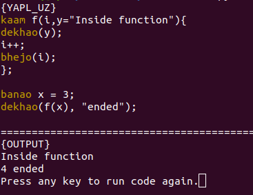

# YAPL UrduZ
YAPL based on the Urdu language using principles from the Theory of Automata.
The interpreter features *syntax highlighting* for the terminal as well and a wide variety of test cases are provided.



## Language features:
- Standard output
- Variables
- Expressions
- Comments
- Error Handling
- Conditional statements
- Do-while Loops
- For loops (with break and continue)
- Lists
- Structs
- Functions & Scope
- Recursion


```
~FUNCTIONS
kaam f(i,y="Inside function"){
    ~OUTPUT
    dekhao(y);
    i++;
    bhejo(i);
};

~VARIABLES
banao x = 3;
banao i = 99;
dekhao(f(x), "ended");

~CONDITIONALS
banao j = 10;
agar (++j == 11) phir{
    dekhao(j);	
}
warna phir{
    dekhao("none");
};

~FOR LOOPS
challo i = 5 se 1 tak -2
{ 
    dekhao(i);
    taapo;
    dekhao(i);
}; 
dekhao(i);

~DO WHILE LOOPS
challo i = 1 se 3 tak
{
    dekhao(i);
    agar i == 2 phir{rukko;};
};

~LISTS
banao a = [3, 4, 5];
dekhao(a);
dekhao(a.index(2));
a.pop(0);
dekhao(a);
a.pop(1);
dekhao(a);
a.push(2);
a.push(9);
dekhao(a);
dekhao(a.slice(0,1));

~STRUCTS
daba Node|id,ip="127.0.0.1", port=5004|;

banao Node mynode;
mynode.id = 87;
mynode.ip = "192.168.1.1";
mynode.port = 5009;
dekhao(mynode.id, mynode.ip, mynode.port);

```

## Instructions:

#### Dependencies:
```
pip3 install termcolor
pip3 install ply
```

#### Execute code:
```
python3 YAPLUZparser.py FILENAME # e.g. test.uz
```